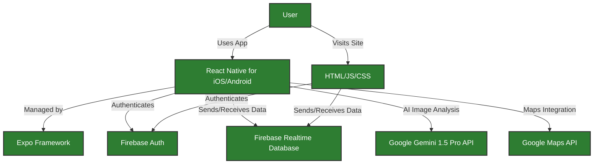

# FoodFind.ai

**Making food security accessible to everyone**

**FoodFind.ai** is an AI-powered platform that connects food donors, recipients, and volunteers—fighting hunger, reducing food waste, and making giving easy for everyone.

## 🚀 Demo

[Download the App >](https://foodfind-ai.web.app/)

**Note:** API keys and database credentials have been removed for security. The codebase is available for review, but you’ll need to download the app from the link above to see **FoodFind.ai** in action.

---

## 🎯 Problem Statement

Every day, tons of food are wasted while millions go hungry. People forage for food without knowing if it’s safe to eat. Donors willing to share surplus food face complicated sign-ups. Volunteers eager to help get stuck in confusing delivery processes. And those in need struggle to find nearby food banks.  

**FoodFind.ai** was created to change this. It bridges these gaps—connecting donors, recipients, and volunteers through a single, seamless platform powered by AI. Our mission: **Less waste, more plates.**

---

## 💡 Solution

**FoodFind.ai** offers a comprehensive, user-friendly solution for food donation and delivery:

### **1. Foraged Food Screen:**  
Wondering if foraged food is safe to eat? Just snap a photo. Our AI, powered by Google Gemini 1.5 Pro, analyzes the image and provides:  
- **Nutritional Profile:** Carbohydrates, proteins, vitamins, and minerals.  
- **Safety Analysis:** Detects toxicity, estimates shelf life, and checks quality.  
- **Additional Notes:** Offers preparation methods, storage tips, and allergen warnings.  
This feature is invaluable for people in need—helping them identify safe, nutritious food instantly.  

### **2. Donate Food Screen:**  
Want to share surplus food? It’s easy—no login required. Donors, including households and restaurants, can quickly post details such as:  
- **Name, Contact, Location:** For direct outreach.  
- **Food Image and Serving Size:** Helping recipients understand what’s available.  
- **Expiry Date and Status Updates:** Mark posts as “Accepting,” “Under Collection,” or “Non-Veg.”  
- **Passcode Protection:** Donors can edit or delete posts later using a unique passcode.  
This no-login, passcode-based system makes donating fast, secure, and user-friendly.  

### **3. Find Food Screen:**  
Need food? Find it instantly. The Find Food screen shows real-time posts from donors, including images, locations, and contact information. Plus:  
- **AI Nutrition Analysis:** Tap the “Nutrition AI” button to instantly analyze the food image, providing nutritional value, freshness, and safety notes.  
- **Contact Donors:** Call or message donors directly from the app.  
- **Request Delivery:** Tap “Request Delivery” to get help from volunteers.  
- **Open in Google Maps:** Get directions to the food pickup location instantly.  

### **4. Volunteer Delivery Screen:**  
Want to help? Deliver food to those in need. The Volunteer Delivery screen lists delivery requests from recipients. Here’s how it works:  
- **Accept Nearby Deliveries:** View donor and recipient details with pickup and drop-off locations.  
- **No Duplicate Claims:** Once a volunteer accepts a request, it disappears for others.  
- **OTP-Based Security:**  
  - Recipients can **dismiss unreliable volunteers** using their OTP, reopening the request for others.  
  - Once delivered, recipients confirm completion using the OTP, closing the request. This OTP-based delivery system ensures secure, efficient deliveries without logins.  

### **5. Food Banks Finder Screen:**  
Looking for a food bank? Find it with a tap. The Food Banks Finder uses Google Maps to show nearby food banks based on your location or entered address. It’s fast, simple, and potentially life-saving.  

### **6. No-Login Architecture:**  
Forget passwords—help faster. Our passcode and OTP-based system means:  
- **Donors:** Post, edit, or delete listings using their passcode—no account needed.  
- **Volunteers:** Accept and complete deliveries with secure OTP verification.  
- **Recipients:** Request deliveries and track status without signing up.  
This secure, no-login system ensures that anyone can contribute or receive help without barriers.  

### **7. Cross-Platform Compatibility (iOS and Android):**  
One app for everyone. Built with React Native, FoodFind.ai runs smoothly on both iOS and Android. Whether you’re a donor on iPhone or a recipient on Android, everyone stays connected. With Expo’s support, the app updates instantly across both platforms—because hunger knows no platform.  

---

## 🛠️ Technology Stack



- **Frontend:** React Native (iOS and Android), HTML/CSS/JavaScript (Landing Page)  
- **App Management:** Expo Framework
- **Authentication:** Firebase Auth (OTP-based)  
- **Database:** Firebase Realtime Database  
- **AI:** Google Gemini 1.5 Pro API (Instructed Model for Image Analysis)  
- **Maps Integration:** Google Maps API  

---

## 📋 Potential Impact

- **Less Waste, More Plates:** Every meal saved from waste becomes a meal served to someone in need.  
- **Every Bite Counts:** Each donation matters—one post, one plate, one life.  
- **Empowering Informed Choices:** AI-powered insights help users identify safe, nutritious food.  
- **Tech That Cares:** Our AI empowers recipients with accurate food safety and nutrition information.  
- **Stronger Together:** FoodFind.ai unites donors, recipients, and volunteers in one community.  
- **Hope on the Map:** Google Maps integration quickly connects people to nearby food banks.  

---

## 💎 Unique Selling Proposition (USP) and Innovation

- **AI That Feeds:** Life-saving AI analysis for foraged and donated food.  
- **Passcodes, Not Passwords:** Manage posts with a passcode—no accounts needed.  
- **OTP-Powered Deliveries:** Secure deliveries verified via OTP.  
- **Cross-Platform, One Community:** Seamless experience across iOS and Android.  
- **A First-of-its-Kind Connection:** The only app connecting donors, recipients, and volunteers on one platform.  

---

## 🚀 Getting Started

### Prerequisites:
- Node.js  
- Expo CLI  
- Firebase Account (with Realtime Database and Auth enabled)  
- Google Gemini API Key  
- Google Maps API Key  

### Installation:

1. **Clone the Repository:**  
   ```bash
   git clone https://github.com/leter-tech/FoodFind.ai.git
   cd foodfind.ai
   ```
2. **Install Dependencies:**  
   ```bash
   npm install
   ```
3. **Add API Keys:**  
   Create a `.env` file and add your Firebase, Gemini API, and Google Maps API keys.

4. **Run the App:**  
   ```bash
   npx expo start
   ```
5. **Open in Emulator or Device:**  
   Use the Expo Go app to scan the QR code and open the app on iOS or Android.

---

## 🤝 Contributing

Contributions are always welcome! Please follow these steps:

1. Fork the repository.  
2. Create a new branch (`git checkout -b feature/your-feature`).  
3. Commit your changes (`git commit -m 'Add your message'`).  
4. Push to the branch (`git push origin feature/your-feature`).  
5. Open a pull request.  

---

Built with ❤️ to reduce food waste and feed those in need.  
